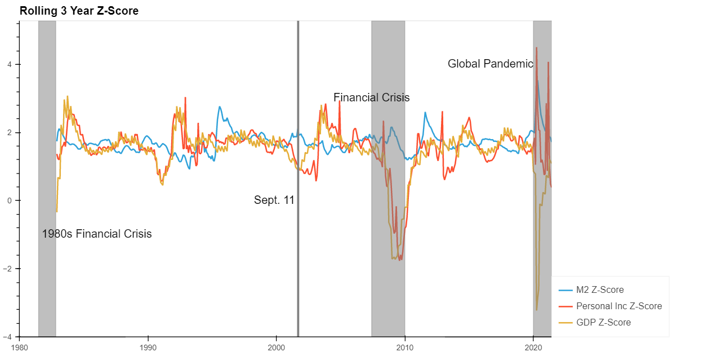
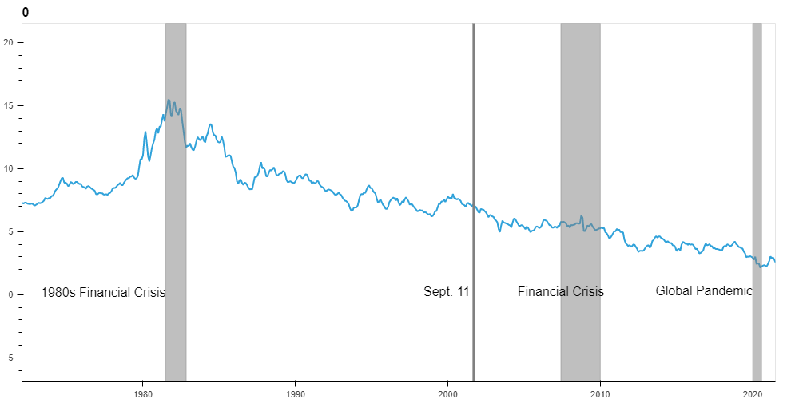
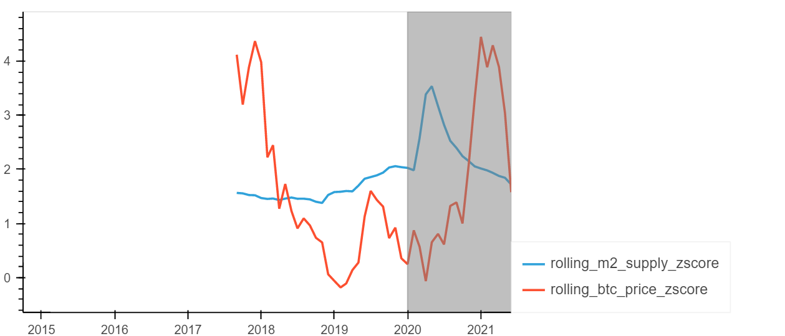
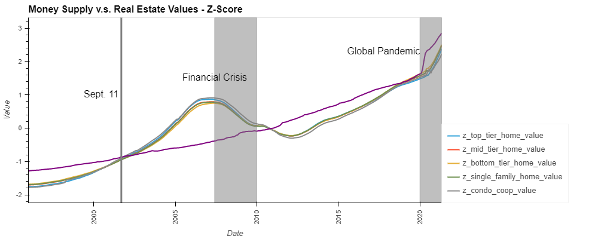
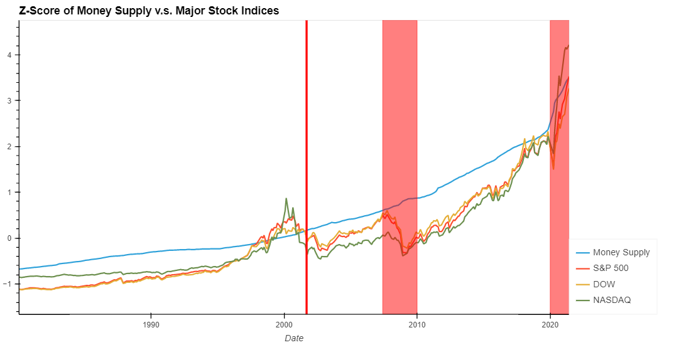

<h1>Effects of Money Supply on Asset Prices and the Economy.</h1>

 
<h2>Does monetary supply actually stimulate the economy or does it inflate investments such as stocks, bonds, crypto, and housing?
</h2> 

<h3>Compare money printed over the past 40 years to</h3>
<ul>
	<li>Real GDP</li>
	<li>Real Personal income</li>
	<li>Stock indices</li>
	<li>Bitcoin price</li>
	<li>Housing prices</li>
	<li>Bonds</li>
</ul>
<h3>Zoom in on significant economic events:</h3>
<ul>
	<li>Financial crisis</li>
	<li>Pandemic</li>
	<li>9/11</li>
</ul>
 
<h2>Data Sources</h2>
<ul>
<h3>FRED economic data</h3>
<ul>
    <li>Monetary supply (M2)</li>
    <li>Real GDP</li>
    <li>Real Personal income</li>
    <li>Bonds</li>
</ul>
<h3>Quandl/Zillow</h3>
<ul>
    <li>Housing prices</li>
</ul> 
<h3>Yahoo:</h3>
<ul>
    <li>Bitcoin price</li>
</ul> 
<h3>Google finance:</h3>
<ul>
    <li>Stock indices</li>
</ul>

 
<h2>
Breakdown of Tasks:
</h2>
<h3>Clean and format data compared to Monetary supply (M2):</h3>
<ul>
    <li>Stocks: Zack</li>
    <li>Bitcoin: Pradeep</li>
    <li>Housing prices: Franklin </li>
    <li>Personal income and GDP: Erik </li>
    <li>Bonds: Cole</li>
</ul>
 
<h2>
Analysis Summary
</h2>

When comparing the money supply over the past 40 years to the major stock indices it does appear that the money supply correlates to the value of the stock market. A line graph of the data shows that the 3 major stock indices (SP500, DOW, and NASDAQ) follow the same upwards trend as the money supply and increases at the same rate (slope of the lines). Given that the some of the values are significantly different, we decided to calcualte a rolling 3 year z-score of each data set in order to normalize the values and compare. When doing this in a line graph we see the same visual trend and correlation as previously described but with normalized magnitudes. Creating a correlation table and heat map for the 40 year comparison data frame supports the observations from the line graph. All of the stock indices are closely correlated to the money supply with the NASDAQ having the loosest correlation at 0.94.   

<h2>Rollling Z-Score: M2 Compared to Personal Income and GDP</h2>

<h2>M2 Compared to Bond Yields</h2>

<h2>Rollling Z-Score: M2 Compared to Bitcoin Prices</h2>

<h2>Rollling Z-Score: M2 Compared to Housing Prices</h2>

During the time frame analyzed (January 1997 to May 2021) the money supple grew at a higher rate than house prices as indicated on the slopes of the curves at the national level.

​

<h2>Rollling Z-Score: M2 Compared to the Stock Market</h2>
