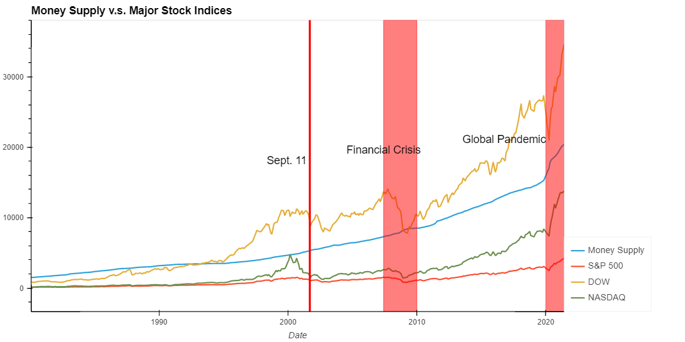
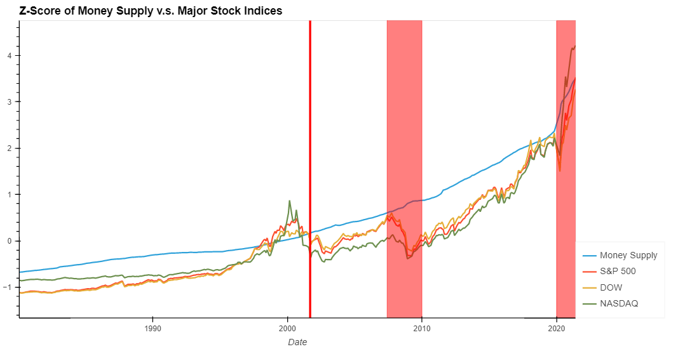
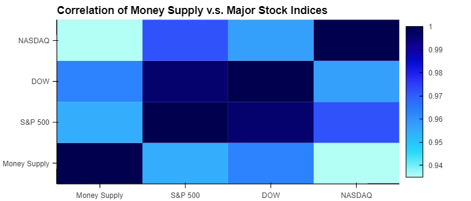
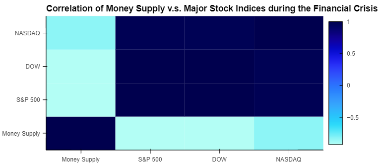
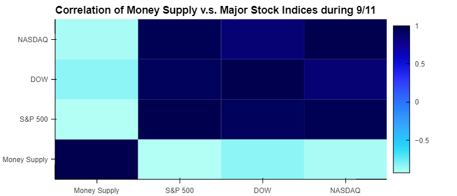
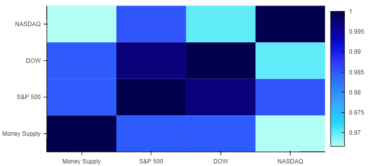

# Fintech_Project_1
# First Group Project

# Research Questions to Answer:
	#* Does monetary supply actually stimulate the economy or does it just pump investments such as stocks, crypto, and housing?
	#* Compare money printed over the past 40 years to
		○ GDP
		○ Personal income
		○ Stock indices
		○ Bitcoin price
		○ Housing prices
		○ Bonds
	- Zoom in on significant economic events 
		○ Financial crisis
		○ Pandemic
		○ 9/11
		○
Data sources:
	- FRED economic data 
		○ Monetary supply (M2)
		○ GDP
		○ Personal income
		○ Housing prices
	- Quandl
		○ Bitcoin price
		○ Bonds
	- Google finance
		○ Stock indices

Breakdown of Tasks:
	- Clean and format data compared to Monetary supply (M2): 
		○ Stocks: Zack
		○ Bitcoin: Pradeep
		○ Housing prices: Franklin
		○ Personal income and GDP: Erik
		○ Bonds: Cole

Analysis summary:

    When comparing the money supply over the past 40 years to the major stock indices it does appear that the money supply correlates to the value of the stock market. A line graph of the data shows that the 3 major stock indices (SP500, DOW, and NASDAQ) follow the same upwards trend as the money supply and increases at the same rate (slope of the lines). Given that the some of the values are significantly different, we dcided to calcualte the z-score of each data set in order to normalize the values and compare. When doing this in a line graph we see the same visual trend and correlation as previously described but with normalized magnitudes. Creating a correlation table and heat map for the 40 year comparison data frame supports the observations from the line graph. All of the stock indices are closely correlated to the money supply with the NASDAQ having the loosest correlation at 0.94.   
	
 
 

    
    In order to to take a closer look at the relationship between money supply and stock values we wanted to look at specific events in time when money supply or stock values went through an abnormal step change. We chose the 9/11 attack due to a sharp drop in stock values following the attacks, the financial crisis due to the extended drop in stock values as well as fiscal stimulus in response to the crisis, and finally the global pandemic due to the market drop and surge of fiscal stimulus pumped into the economy. Looking at the line graphs shown previously, there does not appear to be a correlation between money supply and stock values during 9/11 or the financial crisis. During 9/11 stock prices dip while money supply charges along at the same rate it has for the previous 2 decades. During the financial crisis you can see a small blip in money supply as a result of the stimulus, and while the stock prices appear to begin to recover as a result, stock values don't fully recover for another 4-5 years. Looking at the correlation tables and heat maps for these two periods of time also support the conclusion that money supply was not coupled to changes in stock value. All three of the major stock indices have a -0.5 or greater correlation to money supply during both of these time periods. The global pandemic paints a very different picuture. Looking at the line graphs money supply spikes as a result of the fiscal stimulus pumped into the economy. The rate of increase in money supply during the pamdemic is signicantly higher than any other time in history going back to 1980. While stock prices show a sharp drop, similar to 9/11 and the fincancial crisis, they recover quickly and the recoivery follows the increase in money supply very closely. The correlation table and heat map also show that the correlation between stock indices and money supply is even stronger suring the pandemic than it was over the past 40 years. The 3 major indices have a 0.97 or better correlation to money supply during the pandemic.      

    In conclusion, stock values do appear to follow overall money supply increase over long periods of time (decades). Increasing money supply through stimulus does not always directly relate to or pump stock values, however, the unprecedented increase in monetary supply during the recent pandemic does appear to have directly pumped stock values. The implication of the recent stimulus as well as the long term trend over the past 40 years appears to be that the root value of stock prices are perhaps not based on company performance or valuations but rather total monetary supply.   

