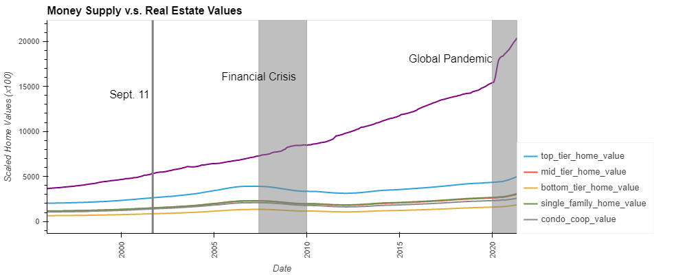
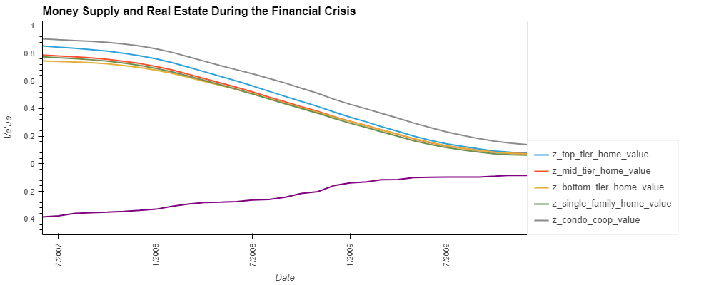
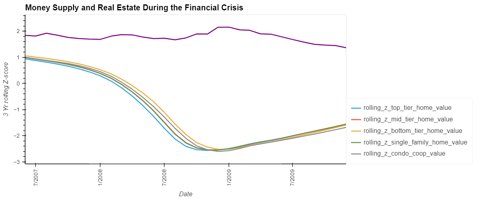
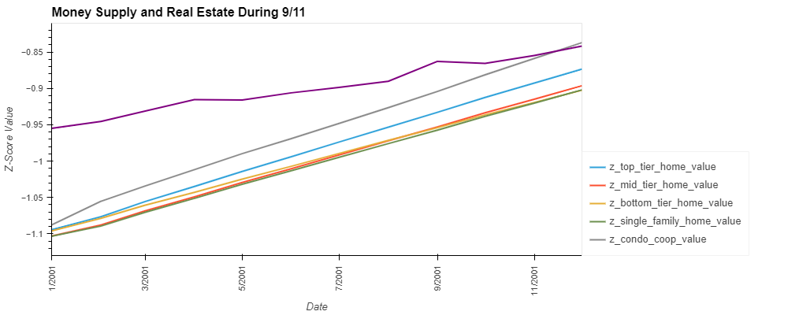
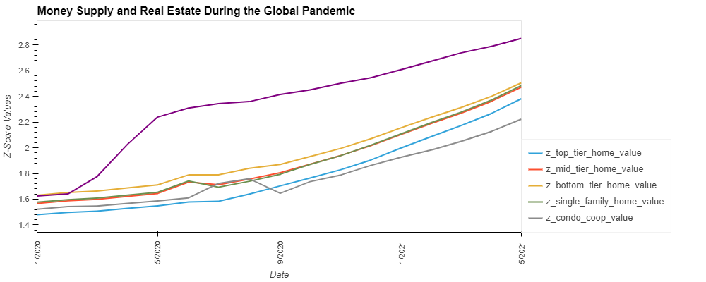

# Fintech_Project_1
First Group Project
Research 

Questions to Answer:

Does monetary supply actually stimulate the economy? What is the effect of Monetary Supply on House Prices over the last 25 years?

# Monetary Supply and Housing Prices
The Housing Prices were obtained from Zillow using the Quandl platform. The time period considered runs from January 1st, 1996 and ended in May 1st, 2021. The Real Estate market information is recorded by Zillow using a total of 56 variables (indicators) on a monthly basis. This information is organized using 3 different datasets that need to be combined to obtain the main dataset. The 3 datasets are:
- ZILLOW/DATA: hat has 56 indicators related to the real estate market: House purchases, etc and uses the indicator_id as the primary key and the region_id to connect with the other datasets
- ZILLOW/INDICATORS: provides the name of each indicator variable via the indicator_id
- ZILLOW/REGIONS has all the names and IDs of all regions (the ids range from the neighborhood level up to the state level)

Monthly information by state and at the nanional level was considered for our analysis.

During the time frame analyzed (January 1997 to May 2021) the money supple grew at a higher rate than house prices as indicated on the slopes of the curves at the national level.

Below you will find the same data normalized by using z-scores. Money supply grew over the entire time period at a steady pace whereas the prices in the housing market are more volatile. The financial crisis period requires special attention since there was a big drop on the housing market and money supply kep growing.   

The rolling 3-year z-score was also considered and it shows that there is lag between real estate prices and money supply. This lag is specially evident after events that are shocks to the economy (such as the Financial Crisis) where House prices went down and still followed the trends in the Money supply. If there was a peak in the money supply it was also followed by a peak in the housing market.

At the state level, even though on average all the housing market of every state follows the same trend, there are major disparities among them, as it can be evidenced on the interactive map of Money Supply vs House Prices by state.

The money supply and house prices appear to be highly correlated (Over 0.99), but this does not imply causality. When analyzing by home type (single family and condos), single family homes show a higher correlation. Additionally, Mid tier homes (valued within the 35th and 65th percentile) and Low tier homes (valued within the 5th and 35th percentile) have a slightly higher correlation than those in the top tier.

Single family homes have a higher correlation with the monetary supply than condos or coops. The effect of changes in monetary supply policy affect single home owners directly whereas this effect is more spread when dealing with condos and coops. 

## Monetary Supply and Housing Prices During Crisis

### Financial Crisis from 2007-6-1 to 2009-12-31

House prices decreased by an average of 14% during the financial crisis, whereas money supply grew by 16% over the same time period. As a result there was a strong negative correlation between the amount of money issued and the housing market.

### September 11, 2001 (9/11): Dates considered from 2001-1-1 to 2001-12-31

### Global Pandemic: Dates considered from 2020-1-1 to 2021-5-1

