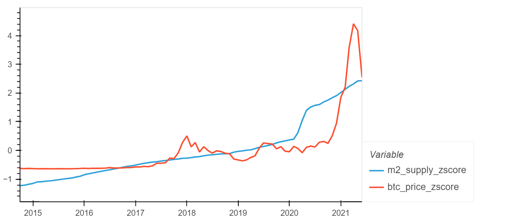
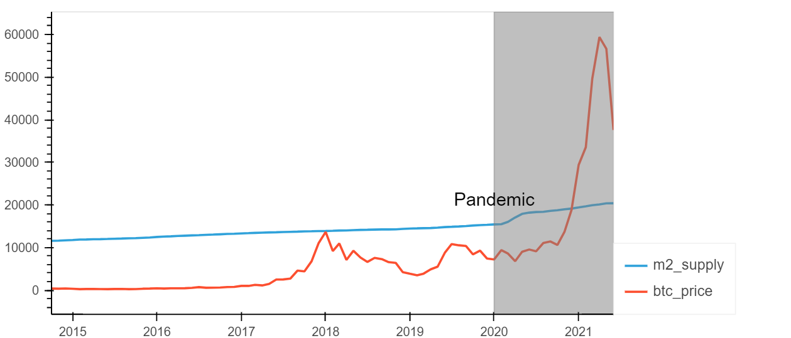

<h1>Effects of Money Supply on Asset Prices and the Economy.</h1>

 
<h2>Does monetary supply actually stimulate the economy or does it inflate investments such as stocks, bonds, crypto, and housing?
</h2> 

<h3>Compare money printed over the past 40 years to</h3>
<ul>
	<li>Real GDP</li>
	<li>Real Personal income</li>
	<li>Stock indices</li>
	<li>Bitcoin price</li>
	<li>Housing prices</li>
	<li>Bonds</li>
</ul>
<h3>Zoom in on significant economic events:</h3>
<ul>
	<li>Financial crisis</li>
	<li>Pandemic</li>
	<li>9/11</li>
</ul>
 
<h2>Data Sources</h2>
<ul>
<h3>FRED economic data</h3>
<ul>
    <li>Monetary supply (M2)</li>
    <li>Real GDP</li>
    <li>Real Personal income</li>
    <li>Bonds</li>
</ul>
<h3>Quandl/Zillow</h3>
<ul>
    <li>Housing prices</li>
</ul> 
<h3>Yahoo:</h3>
<ul>
    <li>Bitcoin price</li>
</ul> 
<h3>Google finance:</h3>
<ul>
    <li>Stock indices</li>
</ul>

 
<h2>
Breakdown of Tasks:
</h2>
<h3>Clean and format data compared to Monetary supply (M2):</h3>
<ul>
    <li>Stocks: Zack</li>
    <li>Bitcoin: Pradeep</li>
    <li>Housing prices: Franklin </li>
    <li>Personal income and GDP: Erik </li>
    <li>Bonds: Cole</li>
</ul>
 
<h2>
Analysis Summary
</h2>

When comparing the money supply over the past 40 years to the major asset classes, like stocks, bonds, housing prices, it does appear that the money supply correlates to the value of these assests. For example, in the below line graph the data shows that the 3 major stock indices (SP500, DOW, and NASDAQ) follow the same upwards trend as the money supply and increases at the same rate (slope of the lines). Given that the some of the values are significantly different, we decided to calcualte the z-score of each data set in order to normalize the values and compare. When doing this in a line graph we see the same visual trend and correlation as previously described but with normalized magnitudes. Creating a correlation table and heat map for the 40 year comparison data frame supports the observations from the line graph. All of the stock indices are closely correlated to the money supply with the NASDAQ having the loosest correlation at 0.94.   

<!--  -->

The economic indicators of GDP and Personal Income show a strong correlation over the last 40 years.  Even the new asset class of crypto currences, like Bitcoin, seem to be extremely correlated.

<h2>40 year Z-Score: M2 Compared to Personal Income and GDP</h2>

 
<h3>Correlation heatmap for 40 Year Z-Scores of M2, GDP, & Personal Income</h3>

<h2>Z-Score: M2 Compared to Bitcoin</h2>

 
<h3>Correlation heatmap for 40 Year Z-Scores of M2 compared to Bitcoin</h3>

<h2>40 year Z-Score: M2 Compared to Housing Prices</h2>

 
<h3>Correlation heatmap for 40 Year Z-Scores of M2 compared to Housing Prices</h3>

<h2>40 year Z-Score: M2 Compared to Bond Yields</h2>

 
<h3>Correlation heatmap for Z-Scores of M2 compared to Bond Yields</h3>

This raises a question whether there could be another factor raising all values of our measurements.  It's important to understand that the Pearson Correlation measures the strength of the ability of two measures to move together at the same rate. To reduce the noise we chose to do a 3 year rolling Z-Score measurement and see what the effects could be.

When the Money Supply (M2) Z-Score is compared to the asset classes over a rolling three year period there is a lot less correlation between Money Supply and the other specified asset.  However, with some assets like real estate, there appears to be a possible delayed correlation between an increase in Money Supply and Housing Prices.

<h2>Rollling Z-Score: M2 Compared to Personal Income and GDP</h2>
<!--  -->

 
<h3>Correlation heatmap for Rolling 3 Year Z-Scores of M2, GDP, & Personal Income</h3>

<h2>Rollling Z-Score: M2 Compared to Bond Yields</h2>
<!--  -->

 
<h3>Correlation heatmap for Rolling 3 Year Z-Scores of M2 and Bond Yields</h3>

<h2>Rollling Z-Score: M2 Compared to Bitcoin Prices</h2>
<!--  -->

 
<h3>Correlation heatmap for Rolling 3 Year Z-Scores of M2 and Bitcoin Prices</h3>

<h2>Rollling Z-Score: M2 Compared to Housing Prices</h2>

During the time frame analyzed (January 1997 to May 2021) the money supple grew at a higher rate than house prices as indicated on the slopes of the curves at the national level.

​
<!--  -->

 
<h3>Correlation heatmap for Rolling 3 Year Z-Scores of M2 and Housing Prices</h3>

<h2>Rollling Z-Score: M2 Compared to the Stock Market</h2>
